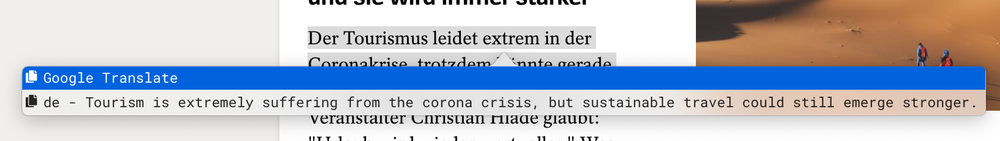

# tip-google-translate
Google cloud translations API integration for Universal Tip.

This is a provider script for a [Universal Tip](https://github.com/tanin47/tip) program for macOS.
The script looks for a translation to target language using Google Translate API when you invoke Tip via it's shortcut.

## Requirements
* Google Cloud account
* Cloud Translation API Enabled
* Service Account with privileges to use Translations API
  * credentials.json file for the Service Account accessible for this provider script
  
## Usage
* On `main.go`, change const `gcTargetLanguage` value to match your desired target language
* Have your GCP credentials on project root named as `credentials.json` during build time
* Run build-deploy.sh
